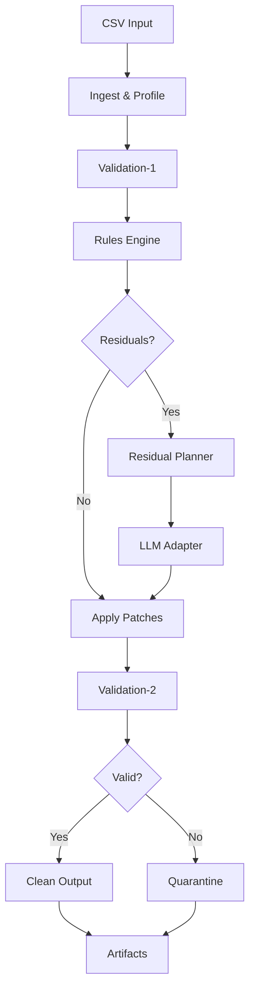

# Centrifuge

A deterministic CSV data cleaning pipeline with rules-first processing and tightly-contracted LLM assistance.

## Overview

Centrifuge is a trustworthy data cleaning system designed for controllers with AI-skeptical bosses. It prioritizes:
- **Determinism**: Identical inputs always produce identical outputs
- **Auditability**: Every change is tracked with source and reason
- **Transparency**: Clear separation between rule-based and LLM-based fixes

### Key Features

- ✅ **Rules-First Approach**: 80%+ of issues fixed deterministically
- ✅ **Contracted LLM**: Tightly scoped AI assistance for specific columns only
- ✅ **Complete Audit Trail**: Every transformation tracked with confidence scores
- ✅ **Idempotent Processing**: Re-running produces no additional changes
- ✅ **Content-Addressed Storage**: Deduplication via SHA-256 hashing
- ✅ **Quarantine System**: Problematic rows isolated with clear categorization

## Quick Start

### Prerequisites

- Python 3.13+
- Docker & Docker Compose
- `uv` package manager (recommended)

### Installation

```bash
# Clone repository
git clone https://github.com/jamesonstone/centrifuge.git
cd centrifuge

# Install dependencies with uv
uv pip install -r requirements.txt

# Or with standard pip
python -m pip install -r requirements.txt
```

### Running Locally

```bash
# Start infrastructure (Postgres, MinIO, LiteLLM proxy)
docker-compose up -d

# Run API server
python -m uvicorn api.main:app --reload

# Submit a cleaning run
curl -X POST http://localhost:8000/runs \
  -F "file=@sample_data.csv" \
  -F "schema_version=1.0.0"

# Check status
curl http://localhost:8000/runs/{run_id}

# Download cleaned data
curl http://localhost:8000/runs/{run_id}/artifacts/cleaned.csv -o cleaned.csv
```

## Architecture



### Components

- **API Layer**: FastAPI endpoints for submission and retrieval
- **Rules Engine**: Deterministic transformations (normalization, formatting)
- **LLM Adapter**: Contract-based AI mapping for specific columns
- **Validation**: Schema enforcement with business rule checks
- **Quarantine**: Isolation of rows that fail validation
- **Artifacts**: Seven output files with complete traceability

## API Reference

See [API Documentation](http://localhost:8000/docs) for interactive OpenAPI documentation.

### Key Endpoints

- `POST /runs` - Submit new cleaning run
- `GET /runs/{id}` - Get run status
- `GET /runs/{id}/artifacts` - List artifacts
- `GET /runs/{id}/artifacts/{name}` - Download artifact

## Development

```bash
# Run tests
pytest tests/

# Run with coverage
pytest tests/ --cov=core

# Format code
black .
isort .

# Type checking
mypy .
```

## License

MIT License - See LICENSE file for details

🧹 Centrifuging Data into Cleaner, Grounded Sources.
