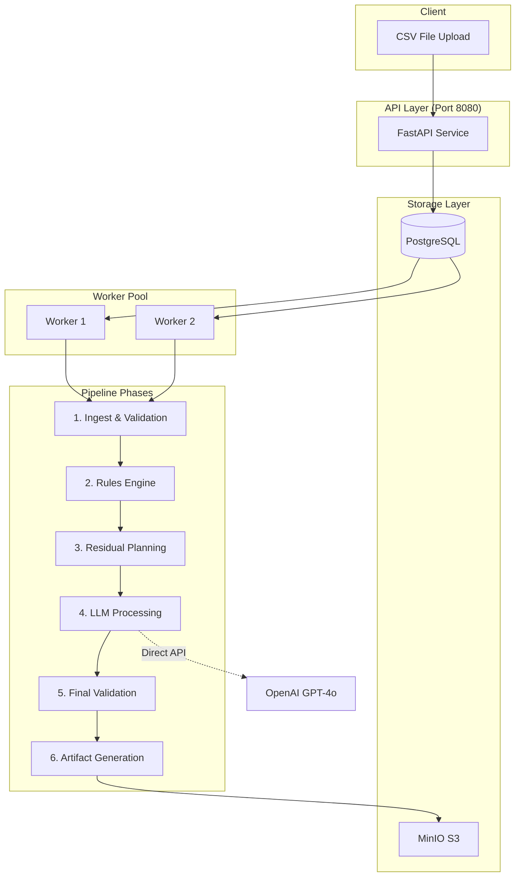

# Centrifuge

🧹 Centrifuging Data into Cleaner, Grounded Sources.

A deterministic CSV data cleaning pipeline with rules-first processing and tightly-contracted LLM assistance.

## Overview

Centrifuge is a trustworthy data cleaning system designed for controllers with AI-skeptical bosses. It prioritizes:

- **Determinism**: Identical inputs always produce identical outputs
- **Auditability**: Every change is tracked with source and reason
- **Transparency**: Clear separation between rule-based and LLM-based fixes

### Key Features

- ✅ **Rules-First Approach**: 80%+ of issues fixed deterministically
- ✅ **Contracted LLM**: Tightly scoped AI assistance for specific columns only
- ✅ **Complete Audit Trail**: Every transformation tracked with confidence scores
- ✅ **Idempotent Processing**: Re-running produces no additional changes
- ✅ **Content-Addressed Storage**: Deduplication via SHA-256 hashing
- ✅ **Quarantine System**: Problematic rows isolated with clear categorization

## Quick Start

```bash
docker-compose up -d
http://localhost:8080/docs  # OpenAPI interactive docs (start by uploading the sample-data.csv file)
```

### Input Example

Using the provided sample data (`sample-data/sample_data.csv` and `sample-data/sample_data-1.csv`):

```bash
curl -X POST 'http://localhost:8080/runs' \
  -H 'accept: application/json' \
  -H 'Content-Type: multipart/form-data' \
  -F 'file=@./sample-data/sample_data-1.csv;type=text/csv' \
  -F 'schema_version=v1' \
  -F 'use_inference=false' \
  -F 'dry_run=false' \
  -F 'llm_columns=Department' \
  -F 'llm_columns=Account Name'
```

### Output Example

(viewable artifacts in `minio`: `http://localhost:9001/browser/centrifuge/artifacts%2<run_id>`)

```bash
centrifuge-worker-1     | 2025-09-14 19:53:32,716 - __main__ - INFO - Processing run d25f6114-382f-4010-aea1-ff2ca5583c41
centrifuge-worker-1     | 2025-09-14 19:53:32,719 - __main__ - INFO - Downloading input from inputs/9b/9b8e0bd4acbe361de88041bdb1fa0076a8f25bfa010d7e467c4487897fa4a231/input.csv
centrifuge-worker-1     | 2025-09-14 19:53:32,728 - core.storage - INFO - Downloaded inputs/9b/9b8e0bd4acbe361de88041bdb1fa0076a8f25bfa010d7e467c4487897fa4a231/input.csv to /tmp/d25f6114-382f-4010-aea1-ff2ca5583c41_input.csv
centrifuge-worker-1     | 2025-09-14 19:53:32,730 - core.pipeline - INFO - Phase 1: Ingesting /tmp/d25f6114-382f-4010-aea1-ff2ca5583c41_input.csv
centrifuge-worker-1     | 2025-09-14 19:53:32 [info     ] File hash computed             hash=9b8e0bd4acbe361de88041bdb1fa0076a8f25bfa010d7e467c4487897fa4a231 source=d25f6114-382f-4010-aea1-ff2ca5583c41_input.csv
centrifuge-worker-1     | 2025-09-14 19:53:32 [info     ] Detected encoding              confidence=0.87625 encoding=utf-8
centrifuge-worker-1     | 2025-09-14 19:53:32 [info     ] Detected delimiter             delimiter="','" score=90
centrifuge-worker-1     | 2025-09-14 19:53:32 [info     ] CSV ingested successfully      columns=10 delimiter="','" encoding=utf-8 rows=42
centrifuge-worker-1     | 2025-09-14 19:53:32,768 - core.pipeline - INFO - Ingested 42 rows
centrifuge-worker-1     | 2025-09-14 19:53:32,769 - core.pipeline - INFO - Phase 2: Applying deterministic rules
centrifuge-worker-1     | 2025-09-14 19:53:32 [info     ] Starting rules engine          rows=42
centrifuge-worker-1     | 2025-09-14 19:53:32 [info     ] Rules engine complete          audit_events=155 patches=155
centrifuge-worker-1     | 2025-09-14 19:53:32,799 - core.pipeline - INFO - Saved 155 audit events to database
centrifuge-worker-1     | 2025-09-14 19:53:32,799 - core.pipeline - INFO - Applied 155 rule fixes
centrifuge-worker-1     | 2025-09-14 19:53:32,800 - core.pipeline - INFO - Phase 3: Planning residual errors
centrifuge-worker-1     | 2025-09-14 19:53:32 [info     ] Identifying residual items     columns=['Account Name']
centrifuge-worker-1     | 2025-09-14 19:53:32 [info     ] Residual identification complete cache_hits=0 cache_misses=0 rows_affected=11 unique_values=11
centrifuge-worker-1     | 2025-09-14 19:53:32 [debug    ] Created batch for Account Name size=11 values=['Freight Expense', 'Bank Fees', 'Interest Income', 'Suspense Account', 'Marketing Expense']
centrifuge-worker-1     | 2025-09-14 19:53:32 [info     ] Created LLM batches            total_batches=1 total_items=11
centrifuge-worker-1     | 2025-09-14 19:53:32,812 - core.pipeline - INFO - Created 1 LLM patches from residual items
centrifuge-worker-1     | 2025-09-14 19:53:32,812 - core.pipeline - INFO - Identified 11 residual items, 9 cache hits
centrifuge-worker-1     | 2025-09-14 19:53:32,812 - core.pipeline - INFO - Phase 4: Processing with LLM (dry_run=False)
centrifuge-worker-1     | 2025-09-14 19:53:32,812 - core.pipeline - INFO - LLM processing debug - residual_plan keys: ['patches']
centrifuge-worker-1     | 2025-09-14 19:53:32,812 - core.pipeline - INFO - LLM processing debug - patches count: 1
centrifuge-worker-1     | 2025-09-14 19:53:32,813 - core.pipeline - INFO - Processing 1 patches with LLM
centrifuge-worker-1     | 2025-09-14 19:53:32,813 - core.pipeline - INFO - Processing patch 1/1: column='Account Name', values_count=11
centrifuge-worker-1     | 2025-09-14 19:53:32,813 - core.pipeline - INFO - LLM request for column 'Account Name': 11 values to process
centrifuge-worker-1     | 2025-09-14 19:53:32,813 - core.llm_client - INFO - Calling real LLM API for column 'Account Name' (model: gpt-4o)
centrifuge-worker-1     | 19:53:32 - LiteLLM:INFO: utils.py:3347 -
centrifuge-worker-1     | LiteLLM completion() model= gpt-4o; provider = openai
centrifuge-worker-1     | 2025-09-14 19:53:32,814 - LiteLLM - INFO -
centrifuge-worker-1     | LiteLLM completion() model= gpt-4o; provider = openai
centrifuge-worker-1     | 2025-09-14 19:53:35,200 - core.llm_client - INFO -   LLM returned 11 mappings for column 'Account Name'
centrifuge-worker-1     | 2025-09-14 19:53:35,201 - core.pipeline - INFO - LLM response for column 'Account Name': success=True
centrifuge-worker-1     | 2025-09-14 19:53:35,201 - core.pipeline - INFO - LLM returned 11 mappings for column 'Account Name'
centrifuge-worker-1     | 2025-09-14 19:53:35,230 - core.pipeline - INFO - LLM fixed 11 values
centrifuge-worker-1     | 2025-09-14 19:53:35,231 - core.pipeline - INFO - Phase 5: Final validation
centrifuge-worker-1     | 2025-09-14 19:53:35 [info     ] Starting post-processing validation rows=42
centrifuge-worker-1     | 2025-09-14 19:53:35 [info     ] Starting validation            rows=42
centrifuge-worker-1     | 2025-09-14 19:53:35 [info     ] Validation complete            quarantined_rows=3 total_errors=4 valid_rows=39
centrifuge-worker-1     | 2025-09-14 19:53:35 [info     ] Quarantine complete            clean_rows=39 error_count=4 quarantined_rows=3
centrifuge-worker-1     | 2025-09-14 19:53:35,243 - core.pipeline - INFO - Final: 39 clean, 3 quarantined
centrifuge-worker-1     | 2025-09-14 19:53:35,244 - core.pipeline - INFO - Phase 6: Generating artifacts
centrifuge-worker-1     | 2025-09-14 19:53:35,247 - core.pipeline - INFO - Stored input file as artifacts/d25f6114-382f-4010-aea1-ff2ca5583c41/input.csv
centrifuge-worker-1     | 2025-09-14 19:53:35 [info     ] Generating artifacts           run_id=d25f6114-382f-4010-aea1-ff2ca5583c41
centrifuge-worker-1     | 2025-09-14 19:53:35 [info     ] Artifact stored to MinIO       artifact=cleaned.csv hash=179cbbab203eb49ee35272505e69d45b9620c5d8562bd0b164d24f6dfd0f2f91 path=artifacts/d25f6114-382f-4010-aea1-ff2ca5583c41/cleaned.csv
centrifuge-worker-1     | 2025-09-14 19:53:35 [info     ] Artifact stored to MinIO       artifact=errors.csv hash=f8441cf61f124968626fc1e8066804acc29bab74edb9d9a5067694b707de969c path=artifacts/d25f6114-382f-4010-aea1-ff2ca5583c41/errors.csv
centrifuge-worker-1     | 2025-09-14 19:53:35 [info     ] Artifact stored to MinIO       artifact=manifest.json hash=4525f6f8e433324751c65225ba8aaca498cb2e0e5717e3bf43be46de3567d8fa path=artifacts/d25f6114-382f-4010-aea1-ff2ca5583c41/manifest.json
centrifuge-worker-1     | 2025-09-14 19:53:35 [info     ] Artifact stored to MinIO       artifact=metrics.json hash=8420838c90cbe9246861daf7fafe30b79513dc05c35fb81157eef63cadd64120 path=artifacts/d25f6114-382f-4010-aea1-ff2ca5583c41/metrics.json
centrifuge-worker-1     | 2025-09-14 19:53:35 [info     ] Artifact stored to MinIO       artifact=summary.md hash=18e3ffd0ed229352113417214f2594f8865499c285de124c98b8863b16572182 path=artifacts/d25f6114-382f-4010-aea1-ff2ca5583c41/summary.md
centrifuge-worker-1     | 2025-09-14 19:53:35 [info     ] Artifacts generated            artifact_count=5 run_id=d25f6114-382f-4010-aea1-ff2ca5583c41
centrifuge-worker-1     | 2025-09-14 19:53:35,259 - core.database - INFO - Registered artifact 1081ad80-59bb-4068-b40c-387431d2940f for run d25f6114-382f-4010-aea1-ff2ca5583c41
centrifuge-worker-1     | 2025-09-14 19:53:35,260 - core.database - INFO - Registered artifact c488bad5-4fb5-4b8d-8fb3-64773c5cbcfc for run d25f6114-382f-4010-aea1-ff2ca5583c41
centrifuge-worker-1     | 2025-09-14 19:53:35,260 - core.database - INFO - Registered artifact 56dcd5e9-dc38-44c3-9ddf-0f6e69ef0bf9 for run d25f6114-382f-4010-aea1-ff2ca5583c41
centrifuge-worker-1     | 2025-09-14 19:53:35,261 - core.database - INFO - Registered artifact edf5352f-738e-4fcd-b138-eb571c04590b for run d25f6114-382f-4010-aea1-ff2ca5583c41
centrifuge-worker-1     | 2025-09-14 19:53:35,261 - core.database - INFO - Registered artifact 10380cae-1bab-44ef-801c-2cadf797f2c2 for run d25f6114-382f-4010-aea1-ff2ca5583c41
centrifuge-worker-1     | 2025-09-14 19:53:35,262 - core.database - INFO - Registered artifact c88e3293-3c73-40b6-95ac-5229ada7e291 for run d25f6114-382f-4010-aea1-ff2ca5583c41
centrifuge-worker-1     | 2025-09-14 19:53:35,262 - core.pipeline - INFO - Generated 6 artifacts
centrifuge-worker-1     | 2025-09-14 19:53:35,263 - core.database - INFO - Saved metrics for run d25f6114-382f-4010-aea1-ff2ca5583c41
centrifuge-worker-1     | 2025-09-14 19:53:35,263 - core.database - INFO - Run d25f6114-382f-4010-aea1-ff2ca5583c41 completed with state partial
centrifuge-worker-1     | 2025-09-14 19:53:35,263 - __main__ - INFO - Run d25f6114-382f-4010-aea1-ff2ca5583c41 completed with state partial
```

### Prerequisites

- Python 3.13+
- Docker & Docker Compose
- `uv` package manager (recommended)
- OpenAI API key (or use mock mode for testing)

### Developing

```bash
# Clone repository
git clone https://github.com/jamesonstone/centrifuge.git
cd centrifuge

# Create .env file with your OpenAI API key
echo "OPENAI_API_KEY=your-api-key-here" > .env
echo "USE_MOCK_LLM=false" >> .env  # Set to true for testing without API

# Install dependencies with uv (recommended)
uv sync

# Or with standard pip
python -m venv .venv
source .venv/bin/activate  # On Windows: .venv\Scripts\activate
pip install -r requirements.txt
```

### Running Locally

```bash
# Start complete stack (API, Workers, Postgres, MinIO)
make stack-up

# Or manually with docker-compose
docker-compose up -d

# Check system health
make health-check

# Check status
curl http://localhost:8080/runs/{run_id}

# Download cleaned data
curl http://localhost:8080/runs/{run_id}/artifacts/cleaned.csv -o cleaned.csv

# View logs
docker-compose logs -f
```

## Architecture



### Components

- **API Service** (`centrifuge-app`): FastAPI endpoints for submission and retrieval (port 8080)
- **Worker Pool** (`centrifuge-worker-1/2`): Async workers that claim and process runs
- **Rules Engine**: Deterministic transformations (80%+ of fixes)
- **LLM Integration**: Direct LiteLLM library integration for Department & Account Name columns only
- **PostgreSQL**: Stores run metadata, canonical mappings cache, and artifact indices
- **MinIO**: S3-compatible storage for input files and output artifacts
- **Validation & Quarantine**: Two-phase validation with problematic row isolation

## API Reference

See [API Documentation](http://localhost:8080/docs) for interactive OpenAPI documentation when the stack is running.

### Key Endpoints

- `POST /runs` - Submit new cleaning run (accepts CSV file up to 50,000 rows)
- `GET /runs/{id}` - Get run status and metadata
- `GET /runs/{id}/artifacts` - List generated artifacts
- `GET /runs/{id}/artifacts/{name}` - Download specific artifact
- `GET /health` - System health check

## Development

```bash
# Run all tests
make test-all

# Run specific test suites
make test-unit         # Unit tests only
make test-integration  # Integration tests
make test-concurrency  # Worker concurrency tests

# Code quality
make lint             # Run linters
make format          # Format with black/isort
make check           # Lint + test

# Database operations
make db-migrate      # Apply migrations
make db-console      # Database shell
make db-status       # Check database status
```

## Documentation Table of Contents

| Title | Description | Location | Last Updated |
|---|---|---:|---|
| [ARCHITECTURE](docs/ARCHITECTURE.md) | System architecture overview and component interactions | `docs/ARCHITECTURE.md` | 2025-09-14 |
| [EMAIL](docs/EMAIL.md) | Candidate submission email template and notes | `docs/EMAIL.md` | 2025-09-14 |
| [LLM_INTEGRATION](docs/LLM_INTEGRATION.md) | Notes on integrating LiteLLM, prompt design, and LLM contracts | `docs/LLM_INTEGRATION.md` | 2025-09-14 |
| [LLM_OPERATION_FLOW](docs/LLM_OPERATION_FLOW.md) | Operational flow for LLM phases, telemetry, and retries | `docs/LLM_OPERATION_FLOW.md` | 2025-09-14 |
| [NOTES](docs/NOTES.md) | Supplemental notes, rationale, and outstanding TODOs | `docs/NOTES.md` | 2025-09-14 |

## Maintenance & Contribution

J.Stone 🥃💎
